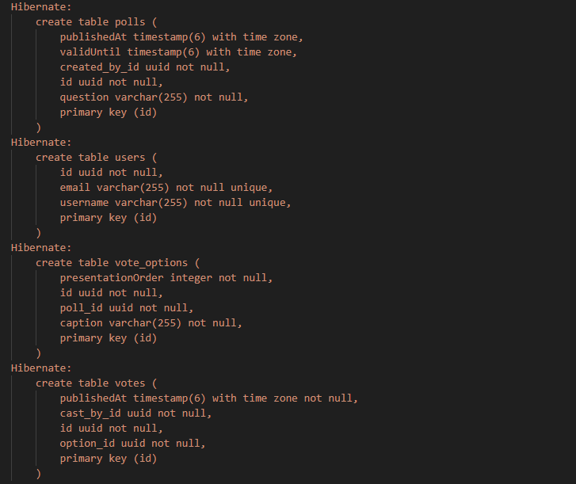
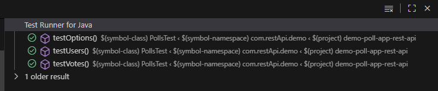
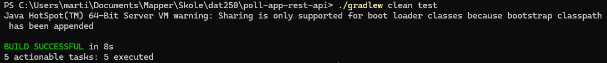

## Expass 4
- Repo link: https://github.com/Martin-Toft/poll-app-rest-api
- Frontend, svelte link: https://github.com/Martin-Toft/poll-app-rest-api/blob/main/frontend/src/App.svelte
- Backend link: https://github.com/Martin-Toft/poll-app-rest-api/tree/main/src/main/java/com/restApi/demo

## What i did
- I kept the contollers pretty much as is, and converted my domain model into JPA entity model with proper JPA annotations
- Added proper relation annotations
- Added helper functions for PollsTest.java file

## Technical problems encountered
- Jakarta import; Had some problems initially with importing jakarta after adding the dependency in the build.gradle.kts file.
  After trying a couple times, i got prompted by VS Code IDE when saving the build file to update a path or something, and after clicking yes, it just fixed the error.

# Database inspection
- To look at the database i added a couple lines in the PollsTest.java file: (.property("hibernate.show_sql", true).property("hibernate.format_sql", true))
  This shows me the generated tables in the build folder after running ./gradlew clean test
  The tables created are: polls, users, vote_options and votes:

Here is also a couple screenshots of the green tests:

## Pending issues
- No pending issues to my knowledge